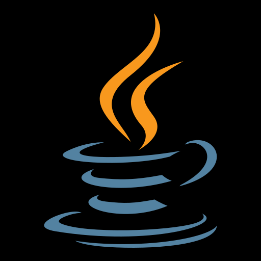
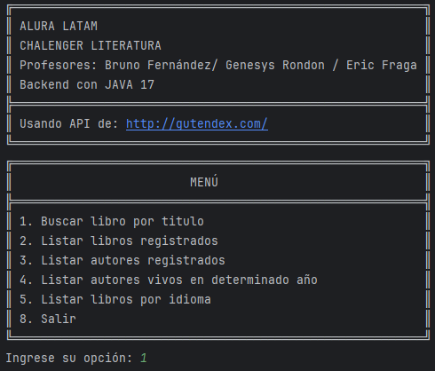
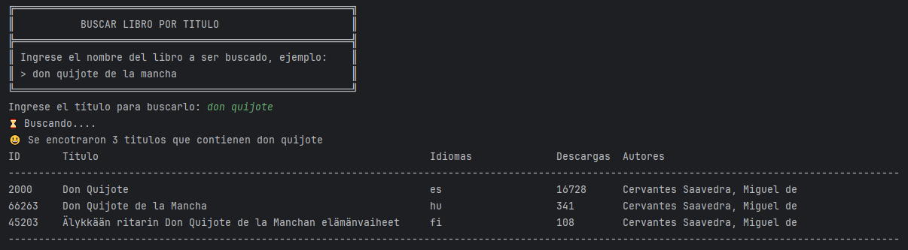
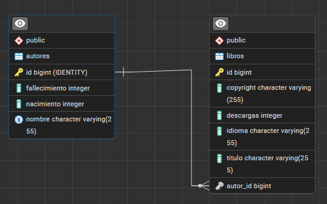

# JAVA SDK 17 + Intellij IDEA
## Challenge Literatura G6 One Version 2
### Profesores: Bruno Fernández / Genesys Rondon / Eric Fraga

    <label></label>

    

### Características del Reto que se personalizarán en esta versión

| Item | Descripción                                     | Observación |
|------|-------------------------------------------------|-------------|
| 1.   | Se respetará el mismo menu del trello           |             |
| 2.   | La API a usar será la recomendada en el trello. |             |
|      | http://gutendex.com/                            |             |

### Tecnologías Utilizadas

| Item | Descripción | Razón                                       |
|------|-------------|---------------------------------------------|
| 1    | Java SDK 17 | nucleo de la aplicacion                     |
| 2    | Spring Boot | framework para facilitar desarrollo         |
| 3    | Data JPA    | para facilitar el desarrollo usando bd      |
| 4    | PostgreSQL  | Base de datos a usar                        |
| 5    | Insomia     | Para validar el uso de la API               |
| 6    | GSON        | Dependencia para manejo de los Json         |
| 7    | Jackson     | Dependencia para manejo de json, 2da opción |

### Clases

| Item         | Descripción            | Observación | Tipo |
|--------------|------------------------|-------------|------|
| Modelos      |                        |             |      |
| 1            | Autor                  |             |      |
| 2            | Datos                  |             |      |
| 3            | DatosAutor             |             |      |
| 4            | DatosLibro             |             |      |
| 5            | Idioma                 |             |      |
| 6            | Libro                  |             |      |
|              |                        |             |      |
| Principal    |                        |             |      |
| 1            | Opciones               |             |      |
| 2            | Principal              |             |      |
|              |                        |             |      |
| Repositorio  |                        |             |      |
| 1            | AutorRepository        |             |      |
|              |                        |             |      |
| Servicio     |                        |             |      |
| 1            | ConsumoAPI             |             |      |
| 2            | ConvierteDatos         |             |      |
| 3            | IConvierteDatos        |             |      |
|              |                        |             |      |
| Main         |                        |             |      |
| 1            | ChallengeLiteratura    |             |      |
|              |                        |             |      |
| Recursos     |                        |             |      |
| 1            | application.properties |             |      |
|              |                        |             |      |
| Dependencias |                        |             |      |
| 1            | pom.xml                |             |      |

### Menú Principal

### Menú 1 Buscar Libro por titulo

### Menú 2 Listar libros registrados

### Menú 3 Listar autores registrados

### Menú 4 Listar autores vivos en determinado año

### Menú 5 Listar libros por idioma

### Menú 8 Salir

### Dependencias Gson:

    <dependency>
			<groupId>com.google.code.gson</groupId>
			<artifactId>gson</artifactId>
			<version>2.11.0</version>
    </dependency>

### Diagrama Entidad Relación en Postgresql

